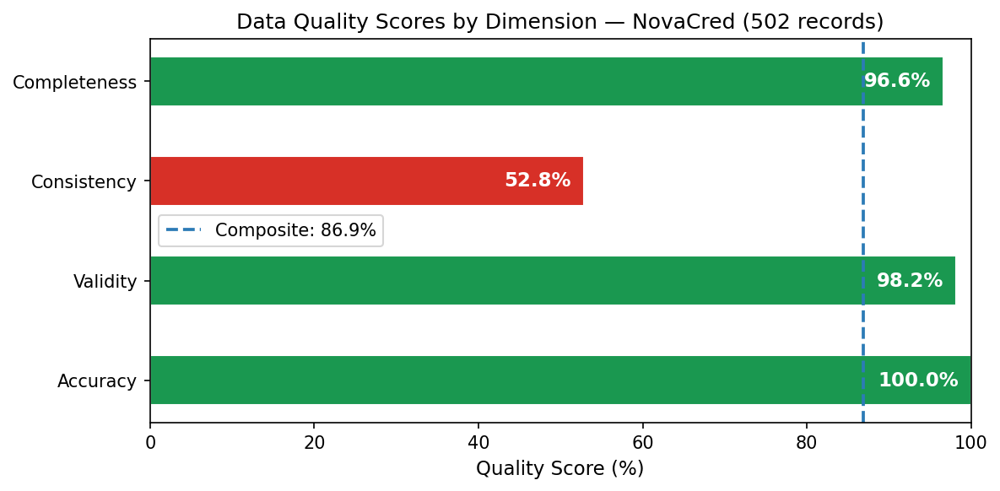
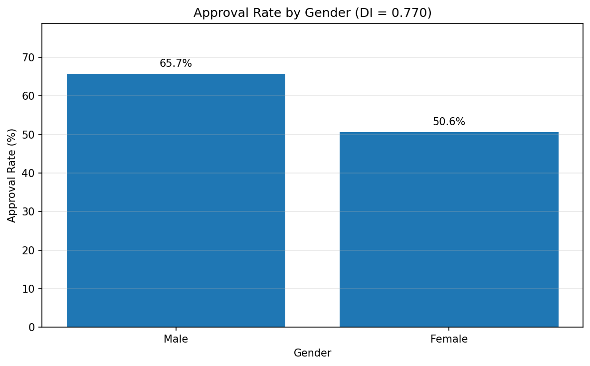
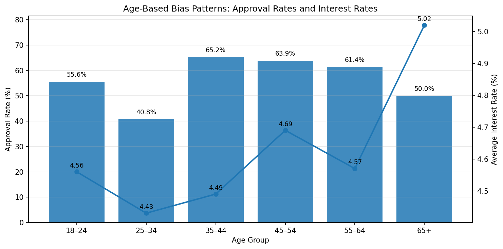
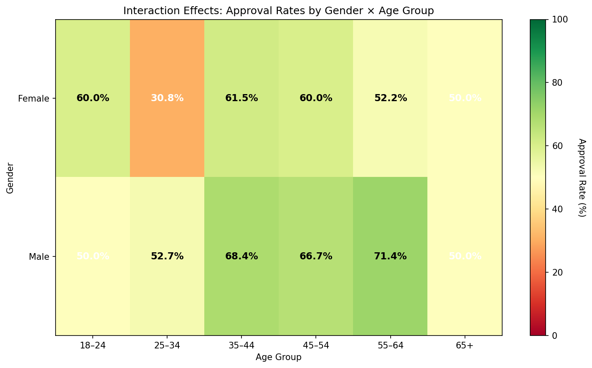

# NovaCred Credit Application Governance Analysis

**DEGO 2606 — Data Ecosystems and Governance in Organizations**
MSc Business Analytics | Nova SBE

> Acting as a Data Governance Task Force for NovaCred, a fintech startup under
> regulatory scrutiny for potential discrimination in lending. We audit 502 credit
> applications for data quality issues, detect algorithmic bias, and propose
> governance interventions under GDPR and the EU AI Act.

---

## Team

| Name | Role | Responsibilities |
|------|------|--------------------|
| Floran Minnaar | Product Lead | Presentation, coordination, README documentation |
| Benedikt Kasior | Governance Officer | GDPR mapping, policy recommendations, compliance analysis |
| Justus Nau | Data Scientist | Bias analysis, fairness metrics, statistical testing |
| Jasper Gräfe | Data Engineer | Data loading, cleaning, pipeline code, repository structure |

### Individual Contributions

The project was coordinated using a shared Notion board that outlined all tasks upfront. Each team member worked from this board and committed their work independently under their own GitHub account. Status updates and quick questions were handled via WhatsApp; more substantive alignment on methodology and direction happened through commit comments, which served as the primary record of cross-team feedback and iteration.

- **Floran Minnaar** set up the Notion board and defined the initial task breakdown. Coordinated the overall project direction through commit-level feedback on each notebook. Authored the README and produced the presentation, which the full team then refined based on each member's analytical contributions. Handles overall messaging and framing in the video.
- **Benedikt Kasior** authored `03-privacy-demo.ipynb` in full: PII identification, GDPR article mapping, EU AI Act classification, UUID-based pseudonymisation demonstration, data subject rights workflows (Art. 15–21), governance controls, and policy recommendations.
- **Justus Nau** authored `02-bias-analysis.ipynb` in full: disparate impact analysis, age-based bias patterns, proxy discrimination analysis using Cramér's V and incremental logistic regression, gender × age interaction effects, fairness scorecard, and fairness recommendations.
- **Jasper Gräfe** authored `01-data-quality.ipynb` in full: data loading, schema profiling, completeness, consistency, validity and accuracy analysis, per-dimension quality scoring, and the clean CSV export pipeline including the aligned decision to exclude 10 incomplete records.

---

## Repository Structure

```
dego-project-team5/
├── README.md                          # Project overview & findings summary
├── data/
│   ├── raw_credit_applications.json   # Original dataset (502 records)
│   └── clean_credit_applications.csv  # Cleaned dataset (492 records, exported by notebook 01)
├── notebooks/
│   ├── 01-data-quality.ipynb          # Data loading, profiling, cleaning
│   ├── 02-bias-analysis.ipynb         # Disparate impact, proxy discrimination
│   └── 03-privacy-demo.ipynb          # PII identification, pseudonymization, GDPR mapping
├── src/
│   └── data_utils.py                  # Reusable utility functions
└── reports/
    └── *.png                          # Figures generated by notebooks
```

---

## How to Run

**Requirements:** Python 3.10+, MongoDB running locally on `localhost:27017`

```bash
pip install pandas numpy matplotlib seaborn pymongo scikit-learn
```

The notebooks run in two independent pipelines:

**Pipeline 1 — Data Quality → Bias Analysis (CSV-based):**
```
01-data-quality.ipynb   →   exports data/clean_credit_applications.csv (492 records)
02-bias-analysis.ipynb  →   reads clean_credit_applications.csv
```
Run notebook 01 first to generate the clean CSV, then run notebook 02.

**Pipeline 2 — Privacy & Governance (MongoDB-based):**
```
03-privacy-demo.ipynb   →   reads from MongoDB collection credit_applications
```
Notebook 03 reads directly from the raw JSON and operates on a MongoDB collection. Before running it, ensure the `novacred.credit_applications` collection is populated with `data/raw_credit_applications.json`.

All output figures are saved automatically to `reports/`.

---

## Dataset

**File:** `data/raw_credit_applications.json`
**Records:** 502 credit applications in nested JSON format
**Clean export:** `data/clean_credit_applications.csv` — 492 records (10 with missing required fields excluded; see Data Quality Findings)
**Schema:** Applicant info (name, email, SSN, IP, gender, DOB, zip), financials
(income, credit history, DTI, savings), spending behavior (array), decision
(approval, rate, amount, rejection reason)

The dataset contains intentional data quality issues and bias patterns discovered
and remediated as part of this audit.

---

## Presentation Link
https://www.youtube.com/watch?v=HOw9heuHYl4

---

## Executive Summary

NovaCred's credit application dataset presents significant governance risks across all four audit dimensions. On data quality, the most critical finding is a consistency score of 52.8%, driven by non-standardised gender codes and non-ISO date formats — issues that are entirely preventable with schema enforcement at the API boundary. On bias, a Disparate Impact Ratio of **0.77** indicates potential disparate impact (four-fifths rule violated) in lending outcomes by gender; age-based patterns and interaction effects compound this risk, with the 25–34 age group showing a gender DI of 0.584. On privacy, all 502 records store five direct identifiers in plaintext within a single document, with no encryption, field-level access control, or data retention policy in place. Under the EU AI Act, NovaCred's scoring algorithm is unambiguously **high-risk** (Annex III §5(b)), creating binding obligations around logging, human oversight, and data governance that the current system does not meet.

---

## Data Quality Findings

Full analysis: `notebooks/01-data-quality.ipynb`

### Quality Scores by Dimension



| Dimension    | Quality Score | Key Issues |
|--------------|:-------------:|------------|
| Completeness | 96.6%         | 10 records missing required fields (excluded from clean export); 4 duplicate `_id`s; 6 duplicate SSNs; 11 duplicate emails |
| Consistency  | 52.8%         | 111 non-standard gender codes (22.1%); 161 non-ISO date formats (32.1%); 5 misnamed income fields (1.0%) |
| Validity     | 98.2%         | 4 malformed emails; 2 negative `credit_history_months`; isolated range violations in income, DTI, savings |
| Accuracy     | 100.0%        | No decision-field contradictions or implausible loan-to-income ratios found |

**Composite Quality Score: 86.9%  *(simple average — unweighted mean of the four dimension scores, as computed in NB01 §7.1)***

Of the 502 raw records, **252 carry at least one data quality flag** and 250 are fully clean.

### Consolidated Issue Report

| Dimension    | Issue                                      | Records Affected | % of Total |
|--------------|-------------------------------------------|:----------------:|:----------:|
| Completeness | Missing ≥1 required field → excluded from clean export | 10 | 2.0% |
| Completeness | Duplicate application `_id`               | 4                | 0.8%       |
| Completeness | Duplicate SSN across applicants           | 6                | 1.2%       |
| Completeness | Duplicate email across applicants         | 11               | 2.2%       |
| Consistency  | Non-standard gender code (M/F)            | 111              | 22.1%      |
| Consistency  | Non-ISO `date_of_birth` format            | 161              | 32.1%      |
| Consistency  | Income stored under wrong field name      | 5                | 1.0%       |
| Validity     | Invalid email format                      | 4                | 0.8%       |
| Validity     | Negative `credit_history_months`          | 2                | 0.4%       |
| Validity     | Zero or negative `annual_income`          | 1                | 0.2%       |
| Validity     | `debt_to_income` outside \[0, 1\]         | 1                | 0.2%       |
| Validity     | Negative `savings_balance`                | 1                | 0.2%       |
| Accuracy     | Decision-field contradictions             | 0                | 0.0%       |
| Accuracy     | Implausible loan-to-income ratio          | 0                | 0.0%       |

### Remediation Applied

All cleaning steps are applied in `01-data-quality.ipynb`. Key transformations: gender codes normalised to full-word form (`M` → `Male`, `F` → `Female`); dates parsed and standardised to ISO 8601; misnamed `annual_salary` field merged into `annual_income`; all PII fields (`full_name`, `email`, `ssn`, `ip_address`) excluded from the clean export in compliance with GDPR Art. 5(1)(c).

**The 10 records missing at least one required field are excluded from the clean export.** This decision was aligned between Jasper (Data Engineer) and Justus (Data Scientist): Justus confirmed that `02-bias-analysis.ipynb` already excludes these records via `.dropna(subset=['gender', 'loan_approved'])` before every Disparate Impact calculation. Dropping them from the CSV export keeps both datasets consistent. The clean export therefore contains **492 records** across 16 columns (41.4 KB).

---

## Bias Analysis

Full analysis: `notebooks/02-bias-analysis.ipynb`

### Disparate Impact — Gender



**Disparate Impact Ratio (DI): 0.77**

*(Four-fifths rule: DI < 0.8 indicates potential disparate impact)*

Male applicants are approved at 65.7% versus 50.6% for female applicants. A DI of 0.77 falls below the 0.8 four-fifths threshold, indicating potential disparate impact in NovaCred's lending decisions.

### Age-Based Patterns



Approval rates and average interest rates were analysed across six age bands. Age-based analysis covers 396 of 502 records — the remaining 106 records have date formats that could not be reliably parsed to a birth year. Results:

| Age Group | Records | Approval Rate | Approved n | Avg Interest Rate |
|-----------|:-------:|:-------------:|:----------:|:-----------------:|
| 18–24     | 8       | 50.0%         | 4          | 4.92%             |
| 25–34     | 121     | 41.3%         | 50         | 4.40%             |
| 35–44     | 141     | 65.3%         | 92         | 4.49%             |
| 45–54     | 72      | 63.9%         | 46         | 4.69%             |
| 55–64     | 44      | 61.4%         | 27         | 4.57%             |
| 65+       | 10      | 50.0%         | 5          | 5.02%             |

The 25–34 group shows the lowest approval rate (41.3%), well below the overall average. The 65+ group is assigned the highest average interest rate (5.02%) among approved applicants. Note that the 18–24 group also shows an elevated rate (4.92%); interest rates span 4.40%–5.02% across all age groups.

### Proxy Discrimination

ZIP code prefix was tested as a proxy variable for protected characteristics. Cramér's V between ZIP prefix and gender was **0.808** — a very strong association, indicating ZIP code is a near-direct proxy for gender in this dataset. The correlation ratio between ZIP prefix and age was **0.031**, suggesting no meaningful age-based geographic clustering. The incremental logistic regression showed a delta AUC of **−0.007** when ZIP is added to the base model, meaning it adds no independent predictive power beyond the financial features already included — the proxy risk here is therefore in data collection, not model leakage.

Spending category was also tested: Cramér's V between top spending category and gender was **0.159** (weak) and between spending category and approval outcome was **0.241** (moderate). No spending category shows a concentration above 80% for a single gender; spending patterns do not constitute a redlining mechanism analogous to ZIP code.

### Interaction Effects



DI ratios were calculated within each age group to detect compounding bias. Two age groups show compounded gender bias below the four-fifths threshold:

| Age Group | Female Approval | Male Approval | Gap     | DI    | Verdict           |
|-----------|:--------------:|:-------------:|:-------:|:-----:|:-----------------:|
| 18–24     | 60.0%          | 50.0%         | +10.0pp | 0.833 | Pass              |
| 25–34     | 30.8%          | 52.7%         | −22.0pp | 0.584 | **VIOLATION**     |
| 35–44     | 61.5%          | 68.4%         | −6.9pp  | 0.899 | Pass              |
| 45–54     | 60.0%          | 66.7%         | −6.7pp  | 0.900 | Pass              |
| 55–64     | 52.2%          | 71.4%         | −19.3pp | 0.730 | **VIOLATION**     |
| 65+       | 50.0%          | 50.0%         | 0pp     | 1.000 | Pass              |

The bias is most severe in the 25–34 band, where fewer than 1 in 3 female applicants is approved.

### Summary of Evidence

| Finding | Magnitude | Statistical Test | Verdict |
|---------|-----------|------------------|---------|
| Gender DI Ratio | 0.7698 | Four-fifths rule | **VIOLATION** |
| Gender Approval Gap | 15.1pp | Approval rate diff | **SIGNIFICANT** |
| Age 25–34 Gender Gap | 22.0pp | DI in subgroup | **SEVERE VIOLATION** |
| Age 55–64 Gender Gap | 19.3pp | DI in subgroup | **MODERATE VIOLATION** |
| ZIP × Gender Association | V=0.808 | Cramér's V | **STRONG** |
| ZIP Predictive Power | AUC Δ=−0.007 | Logistic model | **NONE** |
| Spending × Approval | V=0.241 | Cramér's V | **MODERATE** |
| Spending × Gender | V=0.159 | Cramér's V | **WEAK** |

### Fairness Recommendations

*Source: `notebooks/02-bias-analysis.ipynb`, Section 5 — Justus Nau*

**1. Address Gender Disparate Impact (DI = 0.7698)**
- Audit lending decision logic for gender-dependent variables or unconscious gender bias in underwriting decisions.
- Implement blind review — mask applicant gender during initial credit assessment.
- Establish monthly monitoring: track approval rates by gender and flag if disparity widens.
- Document decision rationale for all denials to identify whether gender correlates with specific rejection reasons.

**2. Address Compounded Bias in 25–34 Age Group (DI = 0.584, 22pp gap)**
- Investigate underwriting factors that disproportionately affect young women (employment stability expectations, savings requirements, income documentation standards).
- Test for unconscious bias in evaluation of employment gaps and non-traditional career paths.
- Require manual review for borderline cases in the 25–34 demographic to prevent algorithmic cascading of bias.
- Standardise income-to-debt thresholds across genders; remove any gender-dependent adjustment factors.

**3. Address Compounded Bias in 55–64 Age Group (DI = 0.730, 19.3pp gap)**
- Investigate how credit history requirements are applied to older women who may have non-traditional credit patterns or spousal financial dependency.
- Test credit score sensitivity across genders; standardise how thresholds are applied.
- Ensure retirement accounts, pension income, and part-time work are valued equally across genders.

**4. Address Age-Based Variation**
- Review why the 25–34 cohort shows the lowest approval rate (41.3%) of any age band. Determine whether the underlying financial features (short credit history, early-career income) are evaluated proportionately.
- Flag the 65+ interest rate premium (5.02% vs 4.40–4.69% for other groups) for actuarial review — the difference may reflect legitimate risk pricing but requires documentation.

---

## Privacy & Governance Assessment

Full analysis: `notebooks/03-privacy-demo.ipynb`

### PII Inventory

| Field | Type | Risk Level | GDPR Basis |
|-------|------|:----------:|------------|
| `applicant_info.full_name` | Direct identifier | 🔴 High | Art. 4(1) |
| `applicant_info.email` | Direct identifier | 🔴 High | Art. 4(1) |
| `applicant_info.ssn` | Direct identifier | 🔴 High | Art. 4(1); Art. 6(1)(c) required |
| `applicant_info.ip_address` | Direct identifier | 🔴 High | Art. 4(1) |
| `_id` (original application ID) | Direct identifier | 🔴 High | Art. 4(1) |
| `applicant_info.date_of_birth` | Quasi-identifier | 🟡 Moderate | Art. 4(1) |
| `applicant_info.zip_code` | Quasi-identifier | 🟡 Moderate | Art. 4(1) |
| `applicant_info.gender` | Quasi-identifier | 🟡 Moderate | Art. 4(1) |
| `spending_behavior.Healthcare` | Sensitive inference risk | 🔴 High | Art. 9 — infers health status |
| `spending_behavior.Gambling` | Sensitive inference risk | 🔴 High | Art. 9 — infers addiction risk |
| `spending_behavior.Adult_Entertainment` | Sensitive inference risk | 🔴 High | Art. 9 — infers sexual behaviour |
| Financial & decision fields (`annual_income`, `credit_history_months`, `debt_to_income`, `savings_balance`, `loan_approved`, `interest_rate`, `approved_amount`, `rejection_reason`) | Personal data — contextually sensitive | 🟡 Moderate | Art. 4(1) |

All 502 records store five direct identifiers in plaintext within a single document with no encryption, field-level access control, or separation of sensitive and non-sensitive fields. A single compromised credential exposes everything, triggering mandatory supervisory authority notification within 72 hours (Art. 33) and direct notification to all affected individuals (Art. 34), with potential administrative fines of up to €10 million under Art. 83(4).

### GDPR Compliance Mapping

| Article | Requirement | Current Status | Gap |
|---------|------------|:--------------:|-----|
| Art. 5(1)(b) — Purpose limitation | Data collected only for specified purposes | ❌ | `ip_address` has no evident credit assessment purpose |
| Art. 5(1)(c) — Data minimisation | Only necessary data retained | ❌ | `ip_address`, granular spending categories, and `ssn` post-intake exceed what scoring requires |
| Art. 5(1)(e) — Storage limitation | Data not kept longer than necessary | ❌ | No retention schedule; all records retained indefinitely |
| Art. 5(2) — Accountability | Processing demonstrably compliant | ❌ | No audit trail for data access or decisions |
| Art. 6 — Lawful basis | Documented basis per processing purpose | ⚠️ | Art. 6(1)(b) covers contract; Art. 6(1)(c) needed for SSN; no consent for Art. 9-adjacent data |
| Art. 7 — Consent | Consent recorded with withdrawal mechanism | ❌ | No consent tracking mechanism exists |
| Art. 17 — Right to Erasure | Erasure procedure in place | ⚠️ | Supported by pseudonymisation design; backup copies and audit logs require separate purging; erasure may be refused where AML retention obligations apply |
| Art. 22 — Automated decisions | Right to human review for automated decisions | ❌ | No human review mechanism for `algorithm_risk_score` rejections |
| Art. 33/34 — Breach notification | Notify authority within 72h; notify individuals | ❌ | No breach detection or notification process documented |
| Art. 35 — DPIA | DPIA required for high-risk processing | ❌ | Not conducted |

### Pseudonymisation Demonstration

`full_name` is pseudonymised using random UUID tokens. Each applicant's real name is replaced with a UUID in the main `credit_applications` collection; the name-to-token mapping is stored in a separate `identity_store` collection under stricter access control. This supports GDPR Art. 17 (erasure is effected by deleting the identity store entry, severing the link) and Art. 15/20 (subject access and portability requests are fulfilled by resolving the token through the identity store). This is pseudonymisation — not anonymisation — because the name can be recovered if the identity store is accessed.

Data subject rights workflows are demonstrated in the notebook for: Art. 15 (access), Art. 16 (rectification), Art. 17 (erasure), Art. 20 (portability), and Art. 21 (objection). For Art. 21 specifically, on receipt of an objection NovaCred must stop automated processing of that record, set a `processing_status: "objection_pending"` flag, and route the case to human review with an audit trail entry.

### EU AI Act Classification

NovaCred's credit scoring algorithm is **high-risk** under the EU AI Act, Annex III §5(b): *"AI systems intended to evaluate the creditworthiness of natural persons or establish their credit score."* This classification is determined by use case, not model complexity — any system producing credit decisions with significant legal effect is in scope regardless of the underlying algorithm.

**Compliance obligations triggered:**

| Article | Obligation | Status |
|---------|-----------|:------:|
| Art. 9 — Risk management | Continuous identification and mitigation of risks throughout lifecycle | ❌ |
| Art. 10 — Data governance | Training data examined for biases; `gender` as input feature requires scrutiny | ❌ |
| Art. 11 — Technical documentation | Full technical documentation prepared before deployment | ❌ |
| Art. 12 — Logging | Automatic logging of system operation for decision traceability | ❌ |
| Art. 14 — Human oversight | Mechanisms for human intervention and override | ❌ |
| Art. 26 — Deployer obligations | Monitor operation; report serious incidents; retain logs ≥6 months | ❌ |
| Art. 49 — Registration | Register with national supervisory authority before EU deployment | ❌ |

---

## Governance Recommendations

### Data Quality Controls

| Issue | Root Cause | Recommended Control |
|-------|-----------|---------------------|
| Non-standard gender codes (22.1%) | No controlled vocabulary enforced | Dropdown/enum field in application form; reject free-text gender input |
| Non-ISO date formats (32.1%) | Date field accepts free text | Replace with date-picker widget; store as ISO 8601 server-side |
| Missing required fields (2.0%) | No mandatory-field enforcement at ingestion | JSON Schema validation at API boundary with required-field constraints |
| Duplicate `_id`s | No uniqueness constraint on primary key | Database-level unique index on `_id`; reject duplicates at write time |
| Misnamed field (`annual_salary`) | No field-name validation | Strict JSON Schema at API boundary; reject unknown field names |
| Malformed emails | No format validation on submission | Regex validation at form level + confirmation email as live check |
| Negative numeric values | No range constraints on inputs | Server-side range validation: `credit_history_months ≥ 0`, `savings_balance ≥ 0` |

### Privacy Controls

1. **Remove `ip_address` from new applications at ingestion** — it serves no credit assessment purpose and directly violates Art. 5(1)(c). The clean CSV export demonstrates data minimisation already in practice; this recommendation targets the root cause upstream at the API level.
2. **Extend pseudonymisation** to `email` and `ssn` — store mappings in `identity_store` under strict access control, mirroring the `full_name` approach demonstrated in the notebook.
3. **Aggregate spending categories** — replace granular sensitive labels (`Healthcare`, `Gambling`, `Adult Entertainment`) with broad buckets (e.g., `discretionary`, `essential`) to eliminate Art. 9 inference risk at the point of collection.
4. **Enforce a retention schedule**: 5 years for rejected applications (EU financial regulation minimum), loan term plus regulatory minimum for approved loans, immediate deletion of `ip_address` on session close.
5. **Deploy the `consent_records` collection** demonstrated in the notebook — explicit opt-in for sensitive spending data, with a `sensitive_data_consent` flag per record and a functional withdrawal pathway linked to the erasure procedure.

### Algorithmic Fairness Controls

6. **Establish a human review queue** for all `algorithm_risk_score` rejections, implementing a `human_review_requested` flag settable by the applicant, a dedicated queue monitored by a credit officer, and a `human_review_completed` timestamp logged to the audit trail. Reviewers must be able to reach a decision independently of the model output. Required under GDPR Art. 22 and EU AI Act Art. 14.
7. **Remove `gender` as a direct model input** — its presence raises immediate Art. 10 EU AI Act obligations and contributes to the measured disparate impact. Legitimate financial features should be sufficient for creditworthiness assessment.

### Accountability Controls

8. **Operationalise the `audit_log` collection** across all data operations — every access, modification, deletion, and automated decision must generate a timestamped entry recording event type, subject token, acting party, and timestamp. This satisfies GDPR Art. 5(2) and EU AI Act Art. 12.
9. **Conduct a DPIA** (Art. 35) — mandatory given the combination of high-risk AI processing, Art. 9-adjacent inferred data, and large-scale financial personal data. Must document residual risks and mitigation measures before production deployment.
10. **Prepare EU AI Act technical documentation** (Art. 11) and register the system with the national supervisory authority (Art. 49) prior to deployment in any EU member state.
